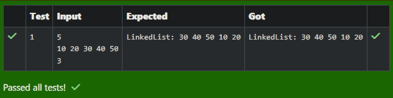

# Ex6 Right Rotation LinkedList
## DATE: 10-08-2024

## AIM:
To write a Java  program to:
Create a singly linked list.
Rotate the linked list to the right by k positions.
Display the rotated linked list.

## Algorithm
1. If the linked list is empty, has only one node, or rotation k is 0, return the head.
2. Traverse the list to find its length and the tail node.
3. Update k as `k = k % length` to handle cases where k is greater than length.
4. Connect the tail to the head to make it a circular linked list.
5. Traverse to the `(length - k)`-th node, which will be the new tail. Update the head to the next node and break the circle by setting the new tail's next to null. Return the new head.

## Program:
```java
/*
Program to  Right Rotation LinkedList
Developed by: Surya Prakash B
RegisterNumber: 212224230281
*/

import java.util.Scanner;
public class RotateLinkedList {
    public static Node rotate(Node head, int k) {
        
        if (head == null || head.next == null || k == 0) {
            return head;
        }
        
        int length = 1;
        Node tail = head;
        
        while (tail.next != null) {
            tail = tail.next;
            length++;
        }
        
        k = k % length;
        
        if (k == 0) {
            return head;
        }
        
        tail.next = head;
        
        int steps = length - k;
        Node newTail = head;
        
        for (int i = 1; i < steps; i++) {
            newTail = newTail.next;
        }
        
        Node newHead = newTail.next;
        newTail.next = null;
        
        return newHead;
    }
    public static void display(Node head) {
        Node current = head;
        System.out.print("LinkedList: ");
        while (current != null) {
            System.out.print(current.data + " ");
            current = current.next;
        }
        System.out.println();
    }
    public static void main(String[] args) {
        Scanner scanner = new Scanner(System.in);
        Node head = null, tail = null;
        int n = scanner.nextInt();
        for (int i = 0; i < n; i++) {
            Node newNode = new Node(scanner.nextInt());
            if (head == null) {
                head = tail = newNode;
            } else {
                tail.next = newNode;
                tail = newNode;
            }
        }
        int k = scanner.nextInt();
        head = rotate(head, k);
        display(head);
        scanner.close();
    }
}
class Node {
    int data;
    Node next;
    Node(int data) {
        this.data = data;
        this.next = null;
    }
}
```

## Output:


## Result:
Thus, the Java program to perform right rotation on linked list is implemented successfully.
